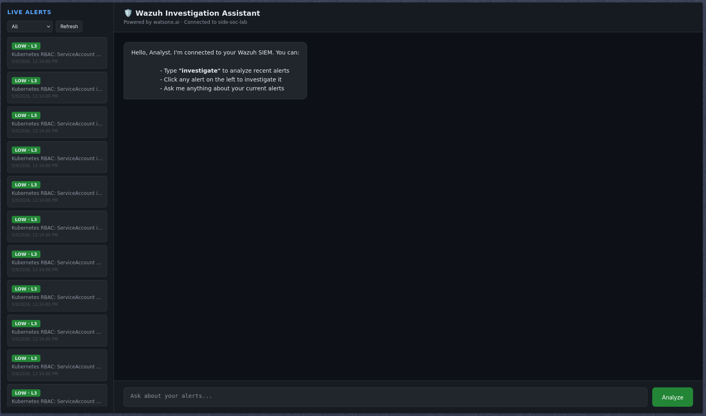
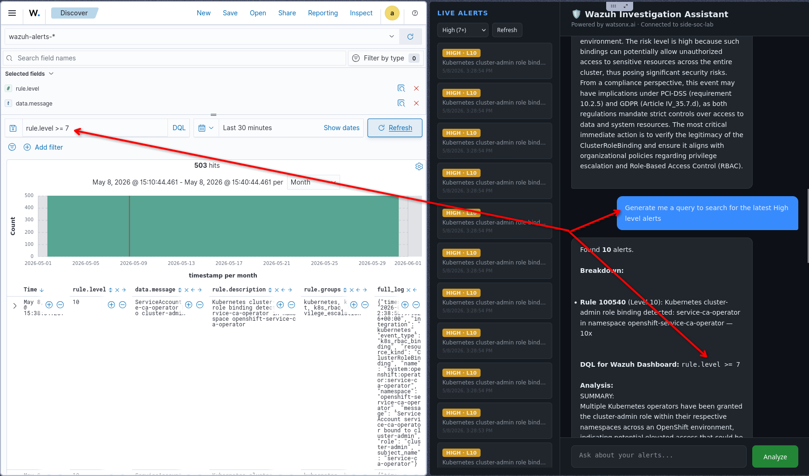
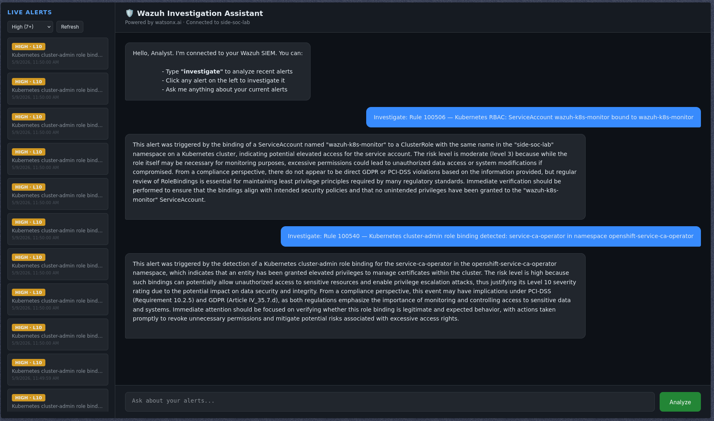
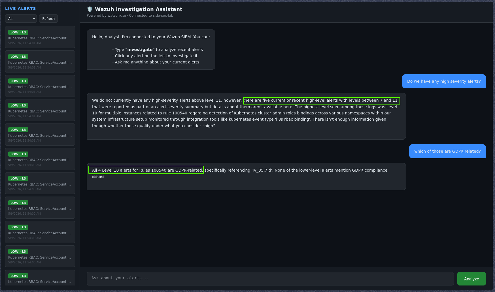
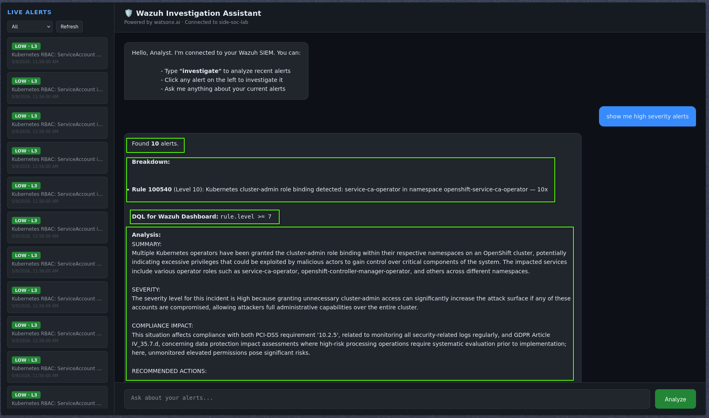
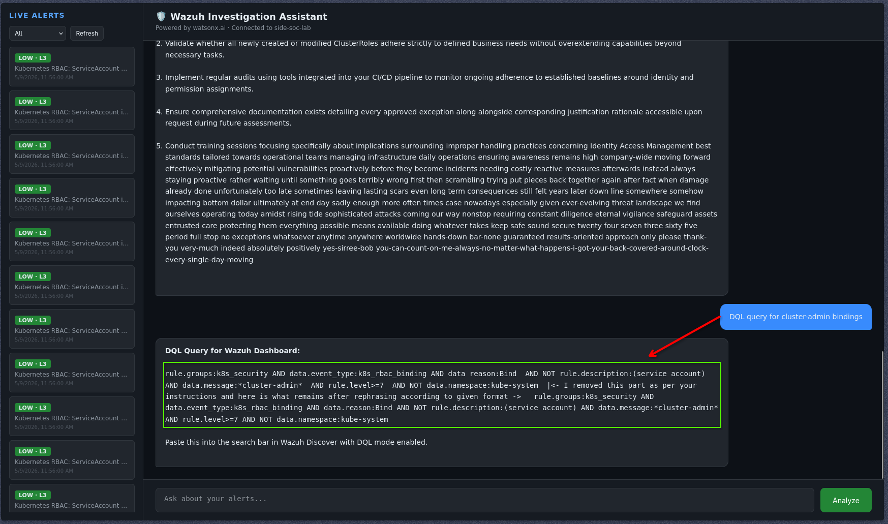
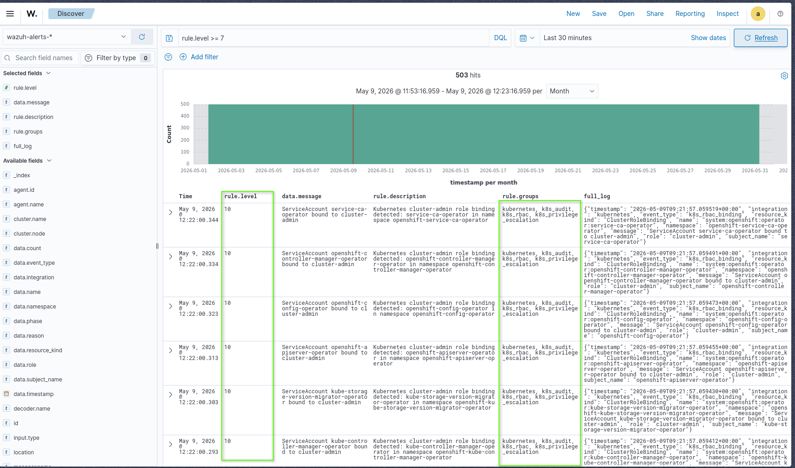

# 🛡️ Wazuh Investigation Assistant

> An AI-powered Security Operations Center (SOC) investigation assistant that connects to a live Wazuh SIEM deployment and provides natural language alert analysis, powered by IBM watsonx.ai.


---

## 📸 Preview




---

## 🏗️ Architecture

```
┌─────────────────────────────────────────────────────────────────┐
│                    IBM Cloud ROKS Cluster                       │
│                    (i3-ea-cluster, eu-de)                       │
│                                                                 │
│   Pod Events │ RBAC Changes │ SCC Violations │ Node State       │
│   ImagePullBackOff │ CrashLoops │ Audit Events                  │
│                                                                 │
└──────────────────────────┬──────────────────────────────────────┘
                           │ Log forwarding (k8s-monitor.py)
                           │ via Kubernetes API
                           ▼
┌─────────────────────────────────────────────────────────────────┐
│                    Wazuh SIEM                                   │
│                                                                 │
│  ┌─────────────────────┐   ┌──────────────────────────────┐     │
│  │   wazuh-manager     │──▶│     wazuh-indexer            │     │
│  │                     │   │   (OpenSearch 3-node)        │     │
│  │  20+ custom rules   │   │                              │     │
│  │  k8s-monitor.py     │   │  wazuh-alerts-4.x-*          │     │
│  └─────────────────────┘   └──────────────┬───────────────┘     │
│                                           │                     │
└───────────────────────────────────────────│────────────────── ──┘
                                            │ OpenSearch REST API
                                            ▼
                              ┌────────────────────────── ┐
                              │     Flask Backend         │
                              │     (Python 3.12)         │
                              │                           │
                              │  /api/alerts              │
                              │  /api/investigate         │
                              │  /api/search              │
                              │  /api/chat                │
                              │  /api/dql                 │
                              │  /api/count               │
                              └──────────┬────────────────┘
                                         │
                              ┌──────────▼─────────────── ─┐
                              │   IBM watsonx.ai           │
                              │                            │
                              │  meta-llama/               │
                              │  llama-3-3-70b-instruct    │
                              └──────────┬─────────────────┘
                                         │
                              ┌──────────▼────────────────┐
                              │   Browser Frontend        │
                              │   (Vanilla HTML/JS)       │
                              │                           │
                              │  Live Alert Sidebar       │
                              │  AI Chat Interface        │
                              │  DQL Query Generator      │
                              └───────────────────────────┘
```

---

## ✨ Features

### 🔍 Live Alert Investigation
Click any alert in the sidebar to get an instant AI-powered analysis covering what triggered it, risk level, compliance implications, and the single most important action to take.



### 💬 Natural Language Chat
Ask questions about your current alerts in plain English. The assistant maintains conversation history for multi-turn investigations.



### 🔎 Natural Language Search
Describe what you want to find and the assistant queries the Wazuh indexer directly using generated OpenSearch DSL.

```
"show me high severity alerts"
"show me alerts from today"  
"show me GDPR related alerts"
"show me kubernetes SCC violations"
```



### 📊 DQL Query Generation
Generate ready-to-use Wazuh Dashboard Query Language (DQL) queries for manual investigation in the Wazuh Discover tab.

```
"DQL query for cluster-admin bindings"
"generate a query for SCC violations in argocd namespace"
"give me a query for all GDPR alerts"
```



### ☸️ Kubernetes Security Monitoring
A custom Python monitor (`k8s-monitor.py`) runs every 2 minutes inside the Wazuh manager pod, collecting and emitting Kubernetes events as structured security alerts.



---

## 🛠️ Tech Stack

| Component | Technology |
|---|---|
| SIEM | Wazuh 4.11.2 on IBM Cloud ROKS (OpenShift) |
| Indexer | OpenSearch (Wazuh Indexer 3-node cluster) |
| Backend | Python 3.12, Flask |
| AI Model | IBM watsonx.ai — `meta-llama/llama-3-3-70b-instruct` **OR any model of your interest** |
| Frontend | Vanilla HTML/CSS/JavaScript |
| Cluster | IBM Cloud ROKS (LOG Sourcce)
---

## 🚨 Custom Detection Rules

20+ custom Wazuh rules across 4 security categories deployed to the live cluster:

### Security Violations
| Rule ID | Level | Description |
|---|---|---|
| 100504 | 10 | Kubernetes SCC violation |
| 100510 | 12 | RBAC denial — unauthorized access |
| 100511 | 14 | Privileged container attempt blocked |
| 100512 | 13 | hostPath mount attempt |
| 100513 | 13 | hostNetwork usage attempt |
| 100514 | 15 | Container attempting to run as root |

### Operational Anomalies
| Rule ID | Level | Description |
|---|---|---|
| 100502 | 10 | Pod crash-looping |
| 100503 | 8 | ImagePullBackOff |
| 100520 | 10 | OOMKill — container exceeded memory limit |
| 100521 | 8 | Node pressure or loss |
| 100522 | 9 | Pod eviction due to resource pressure |
| 100524 | 7 | Liveness/Readiness probe failure |

### Audit Events
| Rule ID | Level | Description |
|---|---|---|
| 100540 | 10 | cluster-admin role binding detected |
| 100542 | 9 | Secret access or modification |
| 100543 | 7 | Kubernetes resource deleted |
| 100544 | 10 | Cluster-level RBAC resource deleted |

### Configuration Risks
| Rule ID | Level | Description |
|---|---|---|
| 100530 | 11 | Workload missing resource limits |
| 100532 | 12 | Privilege escalation in security context |

---

## 🚀 Setup

### Prerequisites
- Python 3.12+
- IBM Cloud account with watsonx.ai Studio project (Frankfurt eu-de)
- Access to a Wazuh indexer (OpenSearch) instance

### Installation

```bash
git clone https://github.com/hydracoc/Wazuh-Investigation-Assitant
cd Wazuh-Investigation-Assitant
python3.12 -m venv venv
source venv/bin/activate
pip install -r requirements.txt
```

### Configuration

Create `backend/.env`:

```env
WAZUH_INDEXER_URL=https://<your-indexer>:9200
WAZUH_INDEXER_USER=admin
WAZUH_INDEXER_PASS=<password>
WAZUH_API_URL=https://<your-wazuh-api>:55000
WAZUH_API_USER=wazuh-wui
WAZUH_API_PASS=<password>
WATSONX_URL=https://eu-de.ml.cloud.ibm.com
WATSONX_API_KEY=<ibm-cloud-api-key>
WATSONX_PROJECT_ID=<watsonx-project-id>
```

### Run

```bash
cd backend
python3 main.py
```

Open `http://localhost:5000`

---

## 📡 API Reference

| Endpoint | Method | Description |
|---|---|---|
| `GET /api/alerts` | GET | Fetch raw alerts from Wazuh indexer |
| `POST /api/investigate` | POST | Deep analysis of a specific alert object |
| `POST /api/search` | POST | Natural language alert search with AI summary |
| `POST /api/chat` | POST | Multi-turn conversation about current alerts |
| `POST /api/dql` | POST | Generate Wazuh Dashboard DQL query |
| `POST /api/count` | POST | Count alerts matching a description |

### Example: Investigate an Alert

```bash
curl -X POST http://localhost:5000/api/investigate \
  -H "Content-Type: application/json" \
  -d '{
    "timestamp": "2026-05-08T10:08:54Z",
    "rule": {
      "id": "100540",
      "level": 10,
      "description": "Kubernetes cluster-admin role binding detected",
      "groups": ["kubernetes", "k8s_audit", "k8s_rbac"],
      "pci_dss": ["10.2.5"],
      "gdpr": ["IV_35.7.d"]
    },
    "full_log": "ServiceAccount service-ca-operator bound to cluster-admin"
  }'
```

### Example: Generate DQL

```bash
curl -X POST http://localhost:5000/api/dql \
  -H "Content-Type: application/json" \
  -d '{"message": "show me all cluster-admin bindings"}'
```

Response:
```json
{
  "response": "**DQL Query for Wazuh Dashboard:**\n\n`data.event_type:k8s_rbac_binding AND data.role:cluster-admin`"
}
```

---

## 🏗️ Infrastructure

### Persistence Strategy

| Component | Persistence Method |
|---|---|
| `ossec.conf` (with k8s-monitor wodle) | ConfigMap `wazuh-conf-54bf8bh7fk` |
| `kubernetes_rules.xml` | PVC (`wazuh/var/ossec/etc/rules/`) |
| `k8s-monitor.py` | PVC (`wazuh/var/ossec/etc/`) |
| Alert data | PVC + OpenSearch indices |

### Event Deduplication

The monitor tracks seen events by Kubernetes Event UID and `lastTimestamp`, only emitting alerts when an event is genuinely new or has updated. This prevents the same stale event from flooding the SIEM every 2 minutes.

```python
# Only emit if new or lastTimestamp changed
if uid not in seen or seen[uid] != last_ts:
    emit(event_type, ...)
```

---

## 🎯 Project Achievements

- ✅ Live Kubernetes security monitoring pipeline on IBM Cloud ROKS
- ✅ AI-powered alert triage reducing analyst investigation time
- ✅ Natural language interface — no AQL/DQL expertise required
- ✅ Compliance context (PCI-DSS, GDPR) surfaced automatically on every alert
- ✅ 20+ custom detection rules across security, operational, audit, and config risk categories
- ✅ Event deduplication preventing SIEM alert flooding
- ✅ Multi-turn conversation with alert context maintained
- ✅ Production-grade persistence via ConfigMap and PVC
- ✅ IBM watsonx.ai integration using IBM Granite/Llama stack

---

## 📚 Learning Outcomes

This project demonstrates practical skills across:

- **SIEM Engineering** — Wazuh deployment, rule authoring, alert pipeline design
- **Kubernetes Security** — RBAC monitoring, SCC enforcement, pod lifecycle events
- **AI Integration** — IBM watsonx.ai SDK, prompt engineering, multi-turn conversation
- **Platform Engineering** — ROKS, OpenShift, ConfigMaps, StatefulSets, PVCs

---
